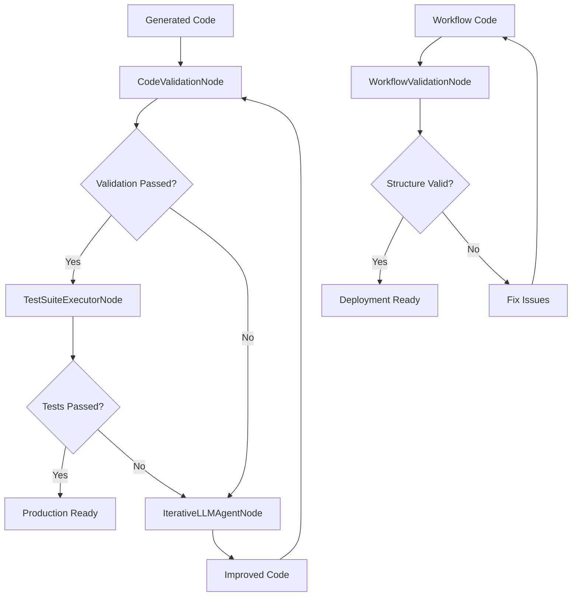

# Validation Framework Guide - Kailash SDK

> **⚡ NEW**: Complete validation framework for test-driven development and quality assurance

## Overview

The Kailash SDK validation framework provides comprehensive code and workflow validation capabilities through three specialized nodes and enhanced IterativeLLMAgent functionality. This framework enables test-driven development, quality gates, and automated validation pipelines.

### Key Components

1. **CodeValidationNode** - Multi-level code validation with sandbox execution
2. **WorkflowValidationNode** - Complete workflow definition validation
3. **TestSuiteExecutorNode** - Comprehensive test suite execution
4. **Enhanced IterativeLLMAgentNode** - Test-driven convergence modes

## Architecture Overview



## CodeValidationNode Deep Dive

### Validation Levels

The CodeValidationNode supports five progressive validation levels:

1. **Syntax** - Python syntax checking
2. **Imports** - Import resolution verification
3. **Semantic** - Code execution testing
4. **Functional** - Output schema validation
5. **Integration** - Full integration testing

### Basic Usage

```python
from kailash.workflow.builder import WorkflowBuilder
from kailash.nodes.validation import CodeValidationNode
from kailash.runtime.local import LocalRuntime

workflow = WorkflowBuilder()

# Basic code validation
workflow.add_node("CodeValidationNode", "validator", {
    "code": """
def process_data(items):
    '''Process a list of items and return statistics.'''
    if not items:
        return {"count": 0, "total": 0, "average": 0}

    total = sum(item.get("value", 0) for item in items)
    count = len(items)
    average = total / count if count > 0 else 0

    return {
        "count": count,
        "total": total,
        "average": average
    }
    """,
    "validation_levels": ["syntax", "imports", "semantic"],
    "test_inputs": {
        "items": [
            {"value": 10},
            {"value": 20},
            {"value": 30}
        ]
    },
    "expected_schema": {
        "count": int,
        "total": int,
        "average": (int, float)
    },
    "timeout": 30,
    "sandbox": True
})

runtime = LocalRuntime()
results, run_id = runtime.execute(workflow.build())

# Check validation results
validation_result = results["validator"]
if validation_result["validated"]:
    print("✅ Code validation passed!")
else:
    print("❌ Validation failed:")
    for result in validation_result["validation_results"]:
        if not result["passed"]:
            print(f"  - {result['level']}: {result['error']}")
```

### Advanced Validation with Schema

```python
# Complex schema validation
workflow.add_node("CodeValidationNode", "advanced_validator", {
    "code": """
import json
from datetime import datetime

def create_user_profile(user_data):
    '''Create a complete user profile with validation.'''
    required_fields = ["name", "email", "age"]

    # Validate required fields
    for field in required_fields:
        if field not in user_data:
            raise ValueError(f"Missing required field: {field}")

    # Create profile
    profile = {
        "user_id": hash(user_data["email"]) % 10000,
        "name": user_data["name"],
        "email": user_data["email"],
        "age": int(user_data["age"]),
        "created_at": datetime.now().isoformat(),
        "status": "active",
        "metadata": {
            "validation_passed": True,
            "profile_version": "1.0"
        }
    }

    return profile
    """,
    "validation_levels": ["syntax", "imports", "semantic", "functional"],
    "test_inputs": {
        "user_data": {
            "name": "John Doe",
            "email": "john@example.com",
            "age": "30"
        }
    },
    "expected_schema": {
        "user_id": int,
        "name": str,
        "email": str,
        "age": int,
        "created_at": str,
        "status": str,
        "metadata": {
            "validation_passed": bool,
            "profile_version": str
        }
    }
})
```

### Error Handling and Diagnostics

```python
# Validate code with intentional errors
workflow.add_node("CodeValidationNode", "error_demo", {
    "code": """
def broken_function(data)
    # Missing colon - syntax error
    result = sum(data) / len(data)
    return result
    """,
    "validation_levels": ["syntax", "imports"]
})

# The validation will fail and provide detailed diagnostics:
# {
#   "validated": False,
#   "validation_results": [
#     {
#       "level": "syntax",
#       "passed": False,
#       "error": "SyntaxError: invalid syntax (line 1)",
#       "suggestions": [
#         "Check for missing colons after function definitions",
#         "Verify proper indentation",
#         "Check parentheses matching"
#       ],
#       "execution_time": 0.001
#     }
#   ]
# }
```

## WorkflowValidationNode Deep Dive

### Structural Validation

```python
from kailash.nodes.validation import WorkflowValidationNode

workflow = WorkflowBuilder()

# Validate workflow structure
workflow.add_node("WorkflowValidationNode", "workflow_validator", {
    "workflow_code": """
from kailash.workflow.builder import WorkflowBuilder

# Create a complete data processing workflow
workflow = WorkflowBuilder()

# Data input layer
workflow.add_node("CSVReaderNode", "data_reader", {
    "file_path": "input_data.csv"
})

# Processing layer
workflow.add_node("FilterNode", "age_filter", {
    "condition": "age >= 18"
})

workflow.add_node("PythonCodeNode", "data_processor", {
    "code": '''
# Calculate statistics
total_users = len(data)
adult_users = len([user for user in data if user.get("age", 0) >= 18])
result = {
    "total_users": total_users,
    "adult_users": adult_users,
    "adult_percentage": (adult_users / total_users * 100) if total_users > 0 else 0
}
    '''
})

# Output layer
workflow.add_node("JSONWriterNode", "output_writer", {
    "file_path": "results.json"
})

# Connect the workflow
workflow.add_connection("data_reader", "result", "age_filter", "input")
workflow.add_connection("age_filter", "result", "data_processor", "input")
workflow.add_connection("data_processor", "result", "output_writer", "input")
    """,
    "validate_execution": False,  # Structure validation only
    "expected_nodes": ["data_reader", "age_filter", "data_processor", "output_writer"],
    "required_connections": [
        {"from": "data_reader", "to": "age_filter"},
        {"from": "age_filter", "to": "data_processor"},
        {"from": "data_processor", "to": "output_writer"}
    ]
})
```

### Execution Validation

```python
# Validate workflow with actual execution
workflow.add_node("WorkflowValidationNode", "execution_validator", {
    "workflow_code": """
from kailash.workflow.builder import WorkflowBuilder

workflow = WorkflowBuilder()

# Simple test workflow
workflow.add_node("PythonCodeNode", "generator", {
    "code": "result = {'numbers': [1, 2, 3, 4, 5]}"
})

workflow.add_node("PythonCodeNode", "processor", {
    "code": "result = {'sum': sum(numbers), 'count': len(numbers)}"
})

workflow.add_connection("generator", "result", "processor", "input")
    """,
    "validate_execution": True,  # Actually run the workflow
    "test_parameters": {},       # Parameters for test execution
    "expected_nodes": ["generator", "processor"],
    "required_connections": [{"from": "generator", "to": "processor"}]
})

# This will execute the workflow and validate that:
# 1. The syntax is correct
# 2. The structure is valid
# 3. The workflow executes without errors
# 4. All expected nodes are present
# 5. All required connections exist
```

## TestSuiteExecutorNode Deep Dive

### Comprehensive Test Suites

```python
from kailash.nodes.validation import TestSuiteExecutorNode

workflow = WorkflowBuilder()

# Execute a comprehensive test suite
workflow.add_node("TestSuiteExecutorNode", "test_runner", {
    "code": """
def calculate_statistics(data_list):
    '''Calculate various statistics for a list of numbers.'''
    if not data_list:
        return {
            "count": 0,
            "sum": 0,
            "mean": 0,
            "min": None,
            "max": None
        }

    count = len(data_list)
    total_sum = sum(data_list)
    mean = total_sum / count
    min_val = min(data_list)
    max_val = max(data_list)

    return {
        "count": count,
        "sum": total_sum,
        "mean": mean,
        "min": min_val,
        "max": max_val
    }
    """,
    "test_suite": [
        {
            "name": "test_empty_list",
            "inputs": {"data_list": []},
            "expected_output": {
                "count": 0,
                "sum": 0,
                "mean": 0,
                "min": None,
                "max": None
            }
        },
        {
            "name": "test_single_element",
            "inputs": {"data_list": [5]},
            "expected_output": {
                "count": 1,
                "sum": 5,
                "mean": 5.0,
                "min": 5,
                "max": 5
            }
        },
        {
            "name": "test_multiple_elements",
            "inputs": {"data_list": [1, 2, 3, 4, 5]},
            "expected_output": {
                "count": 5,
                "sum": 15,
                "mean": 3.0,
                "min": 1,
                "max": 5
            }
        },
        {
            "name": "test_negative_numbers",
            "inputs": {"data_list": [-5, -2, 0, 2, 5]},
            "expected_output": {
                "count": 5,
                "sum": 0,
                "mean": 0.0,
                "min": -5,
                "max": 5
            }
        }
    ],
    "stop_on_failure": False  # Run all tests even if some fail
})

# Results will include detailed test outcomes:
# {
#   "all_tests_passed": True,
#   "validation_status": "PASSED",
#   "test_results": [
#     {
#       "name": "test_empty_list",
#       "passed": True,
#       "execution_time": 0.001,
#       "actual_output": {...},
#       "expected_output": {...}
#     },
#     ...
#   ],
#   "summary": {
#     "total": 4,
#     "passed": 4,
#     "failed": 0
#   }
# }
```

### Test-Driven Development Workflow

```python
# TDD workflow with iterative improvement
workflow = WorkflowBuilder()

# Step 1: Define comprehensive tests first
workflow.add_node("TestSuiteExecutorNode", "tdd_tests", {
    "code": """
# Initial implementation (may fail tests)
def fibonacci(n):
    if n <= 0:
        return 0
    # Incomplete implementation
    return 1
    """,
    "test_suite": [
        {"name": "test_fib_0", "inputs": {"n": 0}, "expected_output": {"result": 0}},
        {"name": "test_fib_1", "inputs": {"n": 1}, "expected_output": {"result": 1}},
        {"name": "test_fib_2", "inputs": {"n": 2}, "expected_output": {"result": 1}},
        {"name": "test_fib_5", "inputs": {"n": 5}, "expected_output": {"result": 5}},
        {"name": "test_fib_10", "inputs": {"n": 10}, "expected_output": {"result": 55}}
    ],
    "stop_on_failure": False
})

# Step 2: Use results to improve code iteratively
# (This would typically be done with IterativeLLMAgentNode)
```

## Enhanced IterativeLLMAgentNode

### Test-Driven Convergence with Real MCP Tool Execution

```python
from kailash.nodes.ai import IterativeLLMAgentNode
from kailash.nodes.ai.iterative_llm_agent import ConvergenceMode

workflow = WorkflowBuilder()

# Agent that only stops when code actually works with real MCP tool support
workflow.add_node("IterativeLLMAgentNode", "test_driven_agent", {
    "provider": "openai",
    "model": "gpt-4",
    "convergence_mode": ConvergenceMode.TEST_DRIVEN,
    "validation_levels": ["syntax", "imports", "semantic", "functional"],
    "max_iterations": 10,
    "use_real_mcp": True,  # Enable real MCP tool execution (v0.6.5+)
    "mcp_servers": [{
        "name": "code-validator",
        "transport": "stdio",
        "command": "python",
        "args": ["-m", "code_validation_server"]
    }],
    "auto_discover_tools": True,
    "auto_execute_tools": True,
    "messages": [{
        "role": "user",
        "content": """
Create a function that processes customer data and returns analytics.
Requirements:
- Accept a list of customer dictionaries
- Calculate total customers, average age, and top purchasing customers
- Return structured data with proper error handling
- Include input validation
        """
    }],
    "test_inputs": {
        "customers": [
            {"id": 1, "name": "John", "age": 30, "purchases": 150.50},
            {"id": 2, "name": "Jane", "age": 25, "purchases": 200.75},
            {"id": 3, "name": "Bob", "age": 35, "purchases": 100.25}
        ]
    },
    "expected_schema": {
        "total_customers": int,
        "average_age": (int, float),
        "top_customers": list,
        "total_revenue": (int, float)
    }
})

# The agent will:
# 1. Generate initial code
# 2. Execute real MCP tools for validation and testing
# 3. If validation fails, analyze failures and improve
# 4. Repeat until all tests pass
# 5. Only converge when deliverables actually work
# 6. Use real external tools for enhanced validation
```

### Hybrid Convergence Mode with MCP Integration

```python
# Combine satisfaction-based and test-driven convergence with real MCP tools
workflow.add_node("IterativeLLMAgentNode", "hybrid_agent", {
    "provider": "openai",
    "model": "gpt-4",
    "convergence_mode": ConvergenceMode.HYBRID,
    "satisfaction_threshold": 0.8,      # Confidence threshold
    "validation_required": True,        # Must pass validation too
    "validation_levels": ["syntax", "semantic"],
    "max_iterations": 8,
    "use_real_mcp": True,              # Enable real MCP tool execution
    "mcp_servers": [{
        "name": "data-processor",
        "transport": "stdio",
        "command": "python",
        "args": ["-m", "data_processing_server"]
    }],
    "auto_discover_tools": True,
    "auto_execute_tools": True,
    "messages": [{
        "role": "user",
        "content": "Create a robust data processing pipeline with error handling"
    }]
})

# Agent will converge when BOTH:
# 1. Satisfaction score >= 0.8
# 2. All validation tests pass
# 3. Real MCP tools execute successfully
```

## Production Validation Pipelines

### Quality Gate Pattern

```python
workflow = WorkflowBuilder()

# Code generation stage
workflow.add_node("LLMAgentNode", "code_generator", {
    "model": "gpt-4",
    "prompt": "Generate data processing code based on requirements"
})

# Quality gate 1: Syntax and basic validation
workflow.add_node("CodeValidationNode", "basic_validation", {
    "validation_levels": ["syntax", "imports"],
    "timeout": 10
})

# Conditional routing based on validation
workflow.add_node("SwitchNode", "quality_gate", {
    "condition": "validation_status == 'PASSED'"
})

# Quality gate 2: Comprehensive testing
workflow.add_node("TestSuiteExecutorNode", "comprehensive_tests", {
    "test_suite": [
        # Define comprehensive test cases
    ],
    "stop_on_failure": True
})

# Quality gate 3: Workflow validation
workflow.add_node("WorkflowValidationNode", "workflow_validation", {
    "validate_execution": True
})

# Production deployment
workflow.add_node("PythonCodeNode", "deploy", {
    "code": "# Deploy to production"
})

# Connect pipeline with quality gates
workflow.add_connection("code_generator", "result", "basic_validation", "input")
workflow.add_connection("basic_validation", "result", "quality_gate", "input")
workflow.add_connection("quality_gate", "result", "comprehensive_tests", "input")
workflow.add_connection("comprehensive_tests", "result", "workflow_validation", "input")
workflow.add_connection("workflow_validation", "result", "deploy", "input")

# Failed validations route back for improvement
workflow.add_connection("quality_gate", "result", "code_generator", "input")
```

### Continuous Validation Pipeline

```python
# Production-grade validation pipeline
workflow = WorkflowBuilder()

# Stage 1: Multi-agent code generation with validation
workflow.add_node("IterativeLLMAgentNode", "primary_agent", {
    "convergence_mode": ConvergenceMode.TEST_DRIVEN,
    "validation_levels": ["syntax", "imports", "semantic"],
    "max_iterations": 5
})

# Stage 2: Peer review simulation
workflow.add_node("CodeValidationNode", "peer_review", {
    "validation_levels": ["syntax", "imports", "semantic", "functional"],
    "test_inputs": {
        # Real-world test data
    },
    "expected_schema": {
        # Production schema requirements
    }
})

# Stage 3: Integration testing
workflow.add_node("TestSuiteExecutorNode", "integration_tests", {
    "test_suite": [
        # Integration test scenarios
    ]
})

# Stage 4: Workflow validation and deployment readiness
workflow.add_node("WorkflowValidationNode", "deployment_check", {
    "validate_execution": True,
    "test_parameters": {
        # Production-like parameters
    }
})

# Stage 5: Performance and security validation
workflow.add_node("CodeValidationNode", "security_scan", {
    "validation_levels": ["syntax", "imports", "semantic"],
    "test_inputs": {
        # Security test cases
    },
    "timeout": 60  # Allow more time for security scans
})

# Connect validation pipeline
workflow.add_connection("primary_agent", "result", "peer_review", "input")
workflow.add_connection("peer_review", "result", "integration_tests", "input")
workflow.add_connection("integration_tests", "result", "deployment_check", "input")
workflow.add_connection("deployment_check", "result", "security_scan", "input")
```

## Best Practices

### 1. Progressive Validation

Start with basic validation and progressively add more comprehensive checks:

```python
# Start simple
validation_levels = ["syntax"]

# Add import checking
validation_levels = ["syntax", "imports"]

# Add execution testing
validation_levels = ["syntax", "imports", "semantic"]

# Add output validation
validation_levels = ["syntax", "imports", "semantic", "functional"]
```

### 2. Appropriate Timeouts

Set reasonable timeouts based on code complexity:

```python
# Simple validation - short timeout
timeout = 10

# Complex processing - moderate timeout
timeout = 30

# Heavy computation or I/O - longer timeout
timeout = 60
```

### 3. Comprehensive Test Suites

Design test suites that cover edge cases:

```python
test_suite = [
    # Happy path
    {"name": "normal_case", "inputs": {"data": [1, 2, 3]}},

    # Edge cases
    {"name": "empty_data", "inputs": {"data": []}},
    {"name": "single_item", "inputs": {"data": [1]}},
    {"name": "large_data", "inputs": {"data": list(range(1000))}},

    # Error cases
    {"name": "invalid_data", "inputs": {"data": None}},
    {"name": "mixed_types", "inputs": {"data": [1, "2", 3.0]}}
]
```

### 4. Effective Use of Schemas

Define clear, precise schemas for output validation:

```python
expected_schema = {
    "result": {
        "count": int,
        "items": list,
        "metadata": {
            "processed_at": str,
            "version": str
        }
    },
    "status": str,
    "errors": list  # May be empty but should exist
}
```

### 5. Integration with CI/CD

Use validation nodes in automated pipelines:

```python
# CI/CD validation workflow
workflow = WorkflowBuilder()

# Pull code from repository
workflow.add_node("GitNode", "source", {"repo": "..."})

# Validate all code files
workflow.add_node("CodeValidationNode", "validate_all", {
    "validation_levels": ["syntax", "imports", "semantic"],
    "batch_mode": True  # Validate multiple files
})

# Run comprehensive test suite
workflow.add_node("TestSuiteExecutorNode", "run_tests", {
    "test_suite": [
        # Load from test files
    ]
})

# Deploy if all validations pass
workflow.add_node("DeploymentNode", "deploy", {"target": "production"})
```

## Error Handling and Debugging

### Common Validation Errors

1. **Syntax Errors**
   ```python
   # Error: Missing colon
   def function()
       return True

   # Fix: Add colon
   def function():
       return True
   ```

2. **Import Errors**
   ```python
   # Error: Non-existent module
   import nonexistent_module

   # Fix: Use available modules
   import json
   ```

3. **Execution Errors**
   ```python
   # Error: Using undefined variable
   result = undefined_variable + 1

   # Fix: Define variable first
   undefined_variable = 0
   result = undefined_variable + 1
   ```

### Debugging Validation Issues

```python
# Enable detailed debugging
workflow.add_node("CodeValidationNode", "debug_validator", {
    "code": "# Your code here",
    "validation_levels": ["syntax", "imports", "semantic"],
    "debug_mode": True,  # If available
    "verbose": True      # Detailed output
})

# Check validation results
result = results["debug_validator"]
print("Validation Summary:")
print(f"  Total tests: {result['summary']['total_tests']}")
print(f"  Passed: {result['summary']['passed']}")
print(f"  Failed: {result['summary']['failed']}")

# Examine failed tests
for test_result in result["validation_results"]:
    if not test_result["passed"]:
        print(f"Failed: {test_result['level']}")
        print(f"  Error: {test_result['error']}")
        print(f"  Suggestions: {test_result['suggestions']}")
```

## Performance Considerations

### Optimization Tips

1. **Use appropriate validation levels** - Don't over-validate simple code
2. **Set reasonable timeouts** - Balance thoroughness with performance
3. **Batch validation when possible** - Validate multiple items together
4. **Cache validation results** - Avoid re-validating unchanged code
5. **Use parallel validation** - Run multiple validations concurrently

### Resource Management

```python
# Efficient validation for large codebases
workflow.add_node("CodeValidationNode", "batch_validator", {
    "code_files": [
        "file1.py",
        "file2.py",
        "file3.py"
    ],
    "validation_levels": ["syntax", "imports"],  # Start with fast validations
    "parallel": True,    # Validate files in parallel
    "timeout": 30,       # Per-file timeout
    "cache_results": True  # Cache validation results
})
```

## Integration Examples

### With MCP Tools

```python
# Validate MCP tool integration
workflow.add_node("WorkflowValidationNode", "mcp_validator", {
    "workflow_code": """
from kailash.workflow.builder import WorkflowBuilder

workflow = WorkflowBuilder()

# MCP-enabled agent
workflow.add_node("MCPAgentNode", "mcp_agent", {
    "model": "gpt-4",
    "mcp_tools": ["file_operations", "web_search"],
    "prompt": "Use tools to gather data and process it"
})

# Validate MCP tool responses
workflow.add_node("CodeValidationNode", "tool_validator", {
    "validation_levels": ["semantic", "functional"]
})

workflow.add_connection("mcp_agent", "result", "tool_validator", "input")
    """,
    "validate_execution": False  # Structure validation only
})
```

### With Enterprise Security

```python
# Security-enhanced validation
workflow.add_node("CodeValidationNode", "security_validator", {
    "code": "# Generated code",
    "validation_levels": ["syntax", "imports", "semantic", "functional"],
    "security_checks": True,     # Enable security scanning
    "sandbox": True,             # Mandatory sandboxing
    "timeout": 30,
    "allowed_imports": [         # Whitelist allowed imports
        "json", "datetime", "math", "statistics"
    ],
    "forbidden_patterns": [      # Patterns to reject
        "eval(", "exec(", "open(", "__import__"
    ]
})
```

## Summary

The Kailash SDK validation framework provides:

- **Comprehensive Code Validation** - Multiple levels from syntax to integration
- **Workflow Validation** - Complete workflow structure and execution validation
- **Test-Driven Development** - Comprehensive test suite execution
- **Enhanced AI Convergence** - Test-driven convergence for quality assurance
- **Production Quality Gates** - Validation pipelines for deployment readiness

Use these tools to ensure code quality, enable test-driven development, and create robust validation pipelines for production deployments.

## See Also

- **[Testing Production Quality](12-testing-production-quality.md)** - SDK testing patterns
- **[Validation Patterns Cheatsheet](../cheatsheet/050-validation-testing-patterns.md)** - Quick reference
- **[Common Mistakes](../validation/common-mistakes.md)** - Error prevention
- **[Node Catalog](../nodes/comprehensive-node-catalog.md)** - All available nodes
