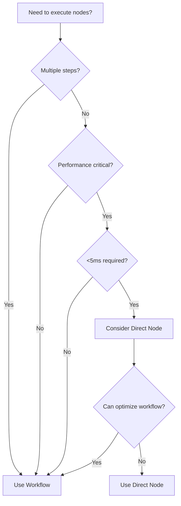

# Direct Node Usage vs Workflow Pattern - Best Practices

## Executive Summary

**Use Workflows** as the default approach. Direct node usage should be an exception, not the rule.

## Quick Decision Guide



## Detailed Comparison

### Workflow Approach (Recommended)

**When to Use** (90% of cases):
- Any multi-step process
- Business logic implementation
- Data transformation pipelines
- User-facing features
- Integration scenarios

**Benefits**:
```python
from kailash.workflow.builder import WorkflowBuilder
# ✅ RECOMMENDED: Workflow approach
workflow = WorkflowBuilder()
workflow.add_node("ValidationNode", "validator", {})
workflow.add_node("UserManagementNode", "creator", {})
workflow.add_connection("validator", "result", "creator", "input")

# With new parameter injection (v0.6.2+)
runtime = LocalRuntime()
results = runtime.execute(workflow.build(), parameters={
    "email": "user@example.com",
    "password": "secure123"
})
```

**Advantages**:
- 📊 Built-in observability and metrics
- 🔄 Easy to modify and extend
- ✅ Automatic validation
- 📝 Self-documenting
- 🔍 Debugging and tracing support
- 🚀 Future-proof (caching, monitoring)
- 👥 Team-friendly

### Direct Node Usage (Exception)

**When Acceptable** (10% of cases):
- Single atomic operations
- Performance-critical paths (<5ms)
- CLI utilities
- Unit testing
- Emergency hotfixes

**Example**:
```python
# ⚠️ ONLY when justified by requirements
from kailash.nodes.auth import UserManagementNode
node = UserManagementNode()
result = node.execute(
    operation="verify_password",
    tenant_id="default",
    database_config=db_config,
    identifier=email,
    password=password
)
```

**Limitations**:
- ❌ No automatic tracking
- ❌ Manual error handling
- ❌ No built-in validation
- ❌ Harder to maintain
- ❌ No visual representation
- ❌ Limited reusability

## Common Scenarios

### Scenario 1: User Registration
```python
# ❌ AVOID: Direct node chain
from kailash.nodes.validation import ValidationNode
from kailash.nodes.auth import UserManagementNode
validator = ValidationNode()
valid_result = validator.execute(data=user_data)
if valid_result["valid"]:
    creator = UserManagementNode()
    user_result = creator.execute(user_data=user_data)

# ✅ RECOMMENDED: Workflow
workflow = build_registration_workflow()
results = runtime.execute(workflow, parameters=user_data)
```

### Scenario 2: Single Query
```python
from kailash.workflow.builder import WorkflowBuilder
# ✅ ACCEPTABLE: True single operation
def get_user_by_id(user_id: str):
    node = UserManagementNode(operation="get_user")
    return node.execute(identifier=user_id)

# ✅ BETTER: Still use workflow for consistency
def get_user_by_id(user_id: str):
    workflow = WorkflowBuilder()
    workflow.add_node("UserManagementNode", "fetcher", {}))
    return runtime.execute(workflow, parameters={"identifier": user_id})
```

### Scenario 3: Performance Critical
```python
from kailash.workflow.builder import WorkflowBuilder
# ⚠️ ONLY if measured and proven necessary
class HighFrequencyHandler:
    def __init__(self):
        # Pre-initialize for performance
        self.auth_node = AuthNode(config=fast_config)

    def authenticate(self, token: str):
        # Direct call for <5ms requirement
        return self.auth_node.execute(token=token)

# ✅ FIRST TRY: Optimized workflow
workflow = WorkflowBuilder()
workflow.add_node("AuthNode", "auth", {}))
# Enable performance optimizations
workflow.metadata["performance_mode"] = "ultra"
```

## Migration Strategies

### From Direct Nodes to Workflows

1. **Identify Direct Node Usage**
   ```python
from kailash.workflow.builder import WorkflowBuilder
   # Before
   result1 = node1.execute(data)
   result2 = node2.execute(result1["output"])
   ```

2. **Convert to Workflow**
   ```python
from kailash.workflow.builder import WorkflowBuilder
   # After
   workflow = WorkflowBuilder()
   workflow.add_node("step1", node1)
   workflow.add_node("step2", node2)
   workflow.add_connection("step1", "result", "step2", "input")
   ```

3. **Use Parameter Injection**
   ```python
from kailash.workflow.builder import WorkflowBuilder
   # Simplified execution
   results = runtime.execute(workflow, parameters={"data": input_data})
   ```

## Performance Considerations

### Workflow Overhead
- Typical overhead: 2-5ms
- Includes: validation, tracking, metrics
- Usually negligible compared to business logic

### When Performance Matters
1. **Measure First**: Profile actual performance
2. **Optimize Workflow**: Try caching, parallel execution
3. **Hybrid Approach**: Critical path direct, rest workflow
4. **Last Resort**: Full direct node implementation

## Best Practices Summary

### ✅ DO
- Use workflows by default
- Leverage parameter injection
- Measure before optimizing
- Document any direct usage
- Consider maintenance cost

### ❌ DON'T
- Default to direct nodes
- Optimize prematurely
- Sacrifice features for minimal gains
- Create unmaintainable code
- Skip workflow benefits

## Decision Checklist

Before using direct nodes, confirm ALL of these:
- [ ] Single atomic operation
- [ ] Measured performance requirement <5ms
- [ ] No need for tracking/metrics
- [ ] No data flow to other operations
- [ ] Documented justification
- [ ] Plan to convert to workflow later

If any checkbox is unchecked, **use a workflow**.

## Example: Proper Test Structure

```python
from kailash.workflow.builder import WorkflowBuilder
# ✅ GOOD: Test uses workflow even for simple operations
async def test_user_creation(self):
    workflow = build_user_workflow()
    results = runtime.execute(workflow, parameters={
        "email": "test@example.com",
        "password": "test123"
    })
    assert results["creator"]["result"]["user_id"]

# ❌ AVOID: Test uses direct nodes
async def test_user_creation(self):
    node = UserManagementNode()
    result = node.execute(user_data={...})
    assert result["user_id"]
```

## Conclusion

The Kailash SDK is designed around workflows. They provide the best balance of:
- **Performance**: Negligible overhead
- **Maintainability**: Clear, modifiable structure
- **Features**: Built-in tracking, validation, etc.
- **Team Work**: Self-documenting, shareable

Direct node usage should be a carefully considered exception, not a shortcut.

**Remember**: The new parameter injection feature (v0.6.2) removes the main pain point of workflows while preserving all their benefits. There's now even less reason to use direct nodes.

## Related Documentation
- [Workflow Parameter Injection Guide](../developer/22-workflow-parameter-injection.md)
- [Workflow Creation Patterns](../developer/02-workflows.md)
- [Performance Guidelines](../architecture/adr/0047-performance-guidelines.md)
- [Architecture Decision Matrix](../decision-matrix.md)
